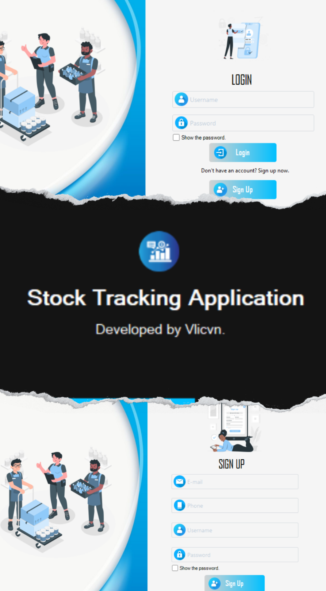
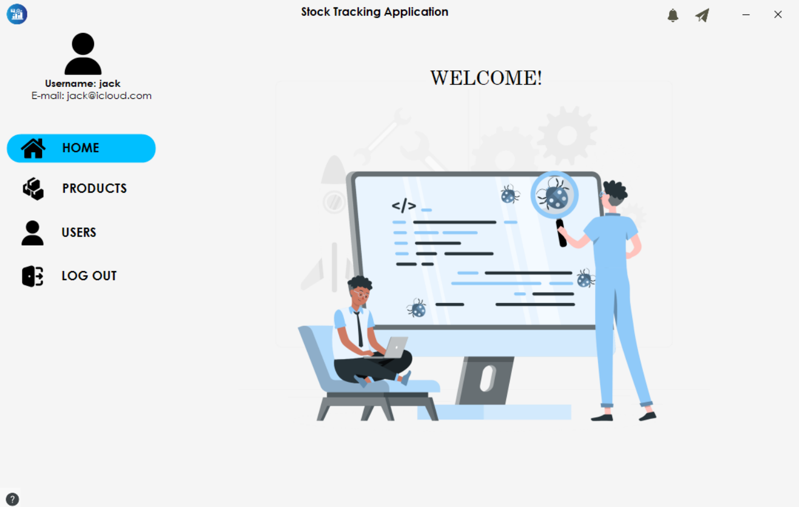

# StockTrackingApplication
Veritabanı olarak Access kullandım.
+ Uygulama çalıştığında bazen "OleDB 12.0 yerel makine kayıtlı değil" gibi bir hata verebilir. Bunun için Access Database Engine indirerek kurmanız lazım.
+ Login ekranında kullanıcı adı ve şifre istemektedir. Access'ten bulabilirsiniz. Yine de ben aşağıda yazdım.
```bash
Kullanıcı Adı: Jack, Şifre: Jack
```

## Kurulum

Projeyi klonlayın ve gerekli bağımlılıkları yükleyin:

```bash
git clone https://github.com/Vlicvn/StockTrackingApplication.git
```
# Screenshots



